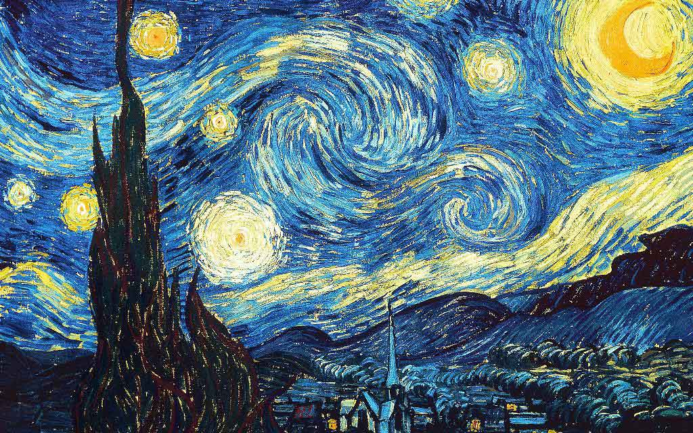
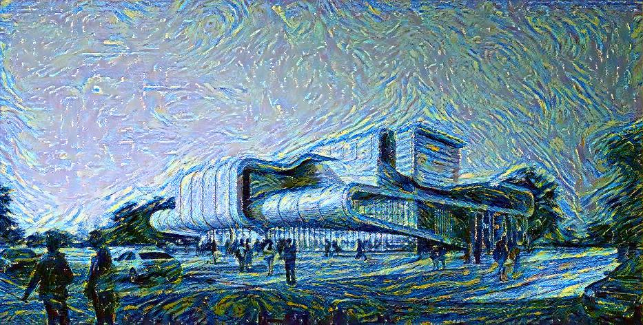

# NeuralStyle
---
​		My own implementation of CVPR 2016 paper: Image Style Transfer Using Convolutional Neural Networks. This work is, I think, simple but elegant (I mean the paper, not my implementation) with good interpretability. 

- CVPR 2016 OpenAccess Link is here: [CVPR 2016 open access](https://openaccess.thecvf.com/content_cvpr_2016/html/Gatys_Image_Style_Transfer_CVPR_2016_paper.html)
- Personal understanding of this paper [Chinese]: [Blog of Enigmatisms/CNN Style Transfer论文复现](https://enigmatisms.github.io/2021/04/21/CNN-Style-Transfer%E8%AE%BA%E6%96%87%E5%A4%8D%E7%8E%B0/)

---

### To run the code

​		Make sure to have Pytorch / Tensorboard on your device, CUDA is available too yet I failed to use it (GPU memory not enough, yet API is good to go). I am currently using Pytorch 1.7.0 + CU101.

​		On Init, it might requires you to download pretrained VGG-19 network, which requires network connection. 

---

### Tree - Working Directory 

- folder `content`: Where I keep content images.
- folder `imgs`: To which the output goes.
- folder `style`:
  - `lossTerm.py`: Style loss and Content loss are implemented here.
  - `precompute.py`: VGG-19 utilization, style and content extractors.
  - **`transfer.py`**: executable script.

---

### A Little Help

​		Always run `transfer.py` in folder `style/`, using `python ./transfer.py -h`， you'll get:

```shell
usage: transfer.py [-h] [--alpha ALPHA] [--epoches EPOCHES]
                   [--max_iter MAX_ITER] [--save_time SAVE_TIME] [-d] [-g]
                   [-c]
optional arguments:
  -h, --help            show this help message and exit
  --alpha ALPHA         Ratio of content loss in the total loss
  --epoches EPOCHES     Training lasts for . epoches (for LBFGS)
  --max_iter MAX_ITER   LBFGS max iteration number
  --save_time SAVE_TIME
                        Save image every <save_time> epoches
  -d, --del_dir         Delete dir ./logs and start new tensorboard records
  -g, --gray            Using grayscale image as initialization for generated
                        image
  -c, --cuda            Use CUDA to speed up training
```

---

### Requirements

- Run:

```
python3 -m pip install -r requirements.py
```

​		To find out.

---

### Results

- CPU training is tooooooo slow. Took me 2+ hours for 800 iterations. (i5-8250U 8th Gen @ 1.60Hz)

|  |  |   |
| :----------------------------------------------: | :------------------------: | :--------------------: |
|                      Style                       |          Content           | Output(800 Iterations) |

